## 6.4

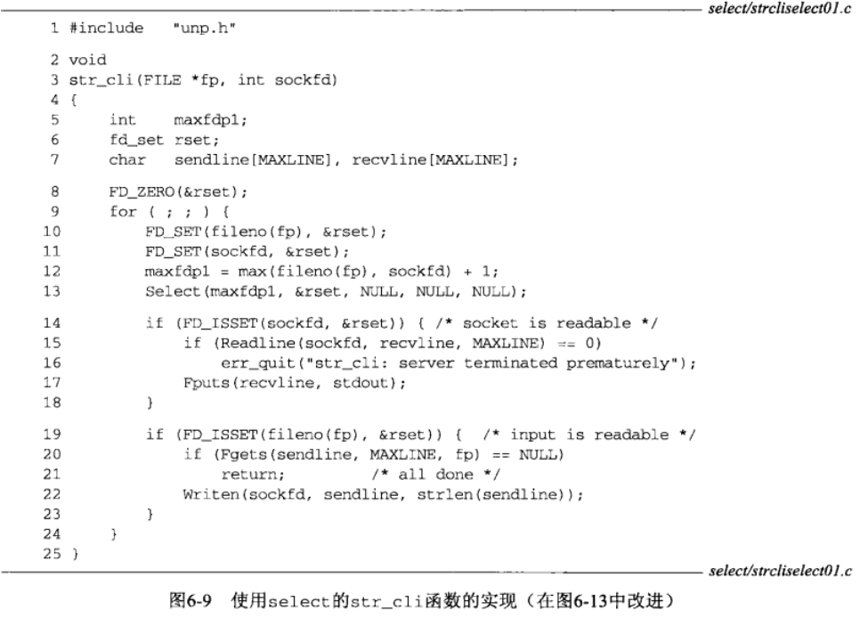

## 6.5

问题：输出总是小于输入，部分输入内容被“抛弃”了

两个原因：

问题1:

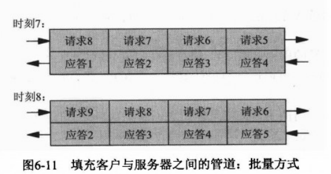

请求9发送后，检测到标准输入EOF，return，中止。但此时仍有请求在发送,同时也有很多应答没有接收到。

解决方式：关闭TCP链接的写部分。

问题2：

stdio会自己维护一个缓冲区。而select只从read系统层面上判断某套接字是否可读。若缓冲区内容并未完全刷新到文件或套接字中，select就报告某socket可读，则又会再次调用标准io，上一次标准io缓冲内的数据就可能无法全部刷新到文件或套接字中。

解决方法：不混用stdio和select，或及时手动刷新stdio缓冲区。

## 6.7 再修订

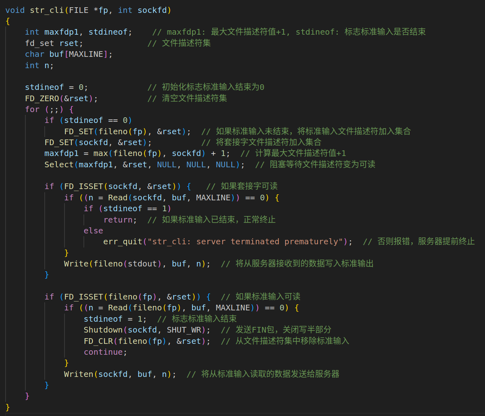

## 6.9

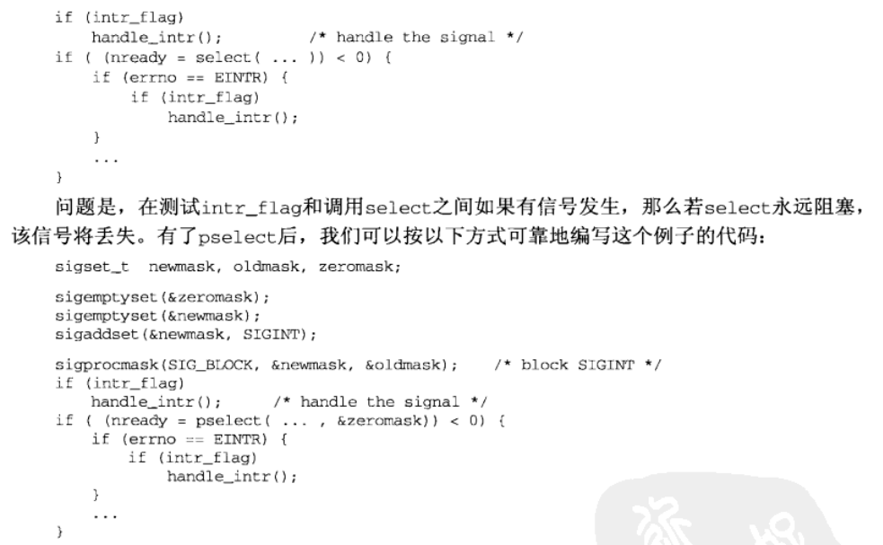	

## 6.11

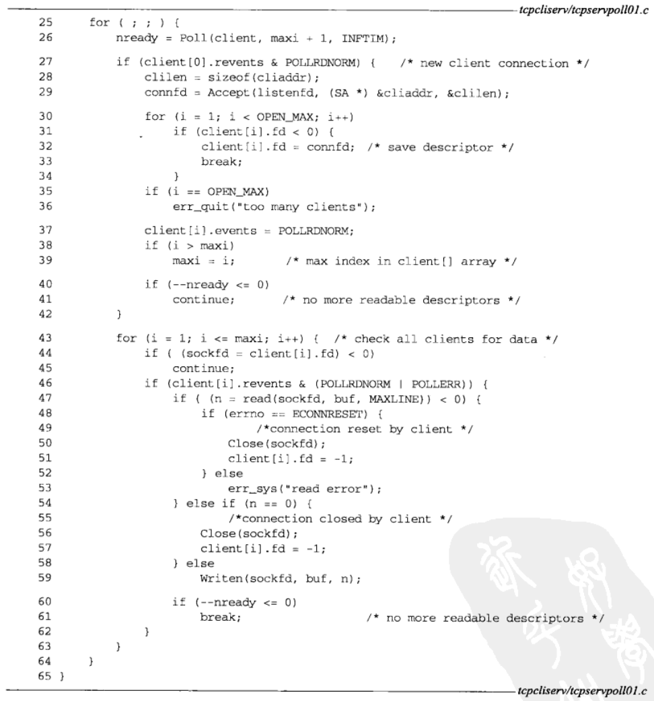

## 补充：epoll

select：

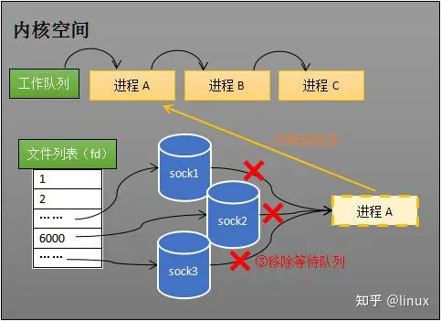

维护等待队列和阻塞操作分离：

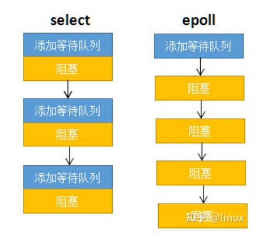

维护sock就绪列表：

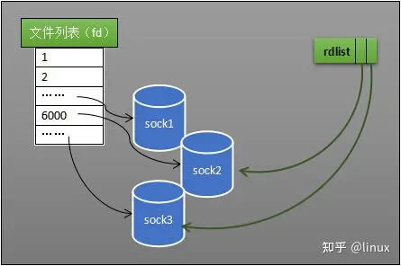

```c
int epoll_create(int size);
int epoll_ctl(int epfd, int op, int fd, struct epoll_event *event);
int epoll_wait(int epfd, struct epoll_event *events,int maxevents, int timeout);
```

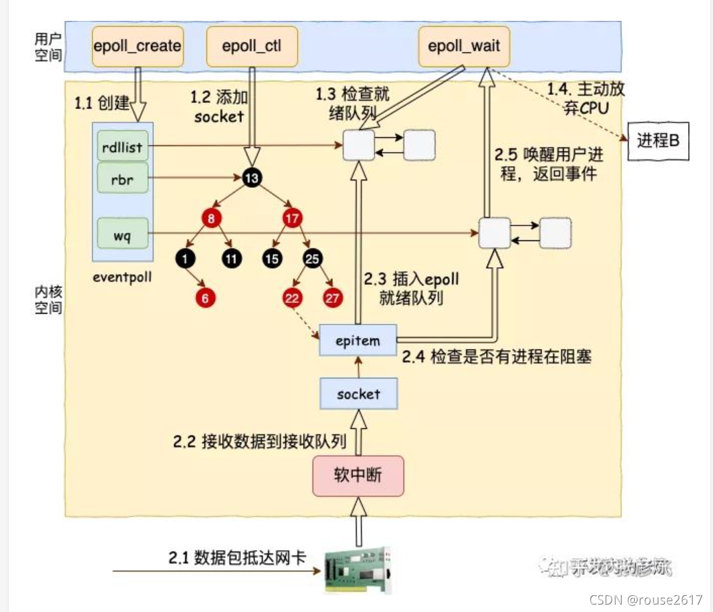

深入理解linux网络

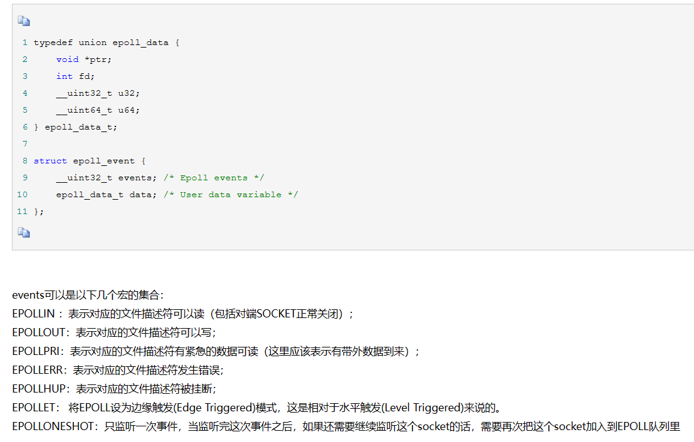

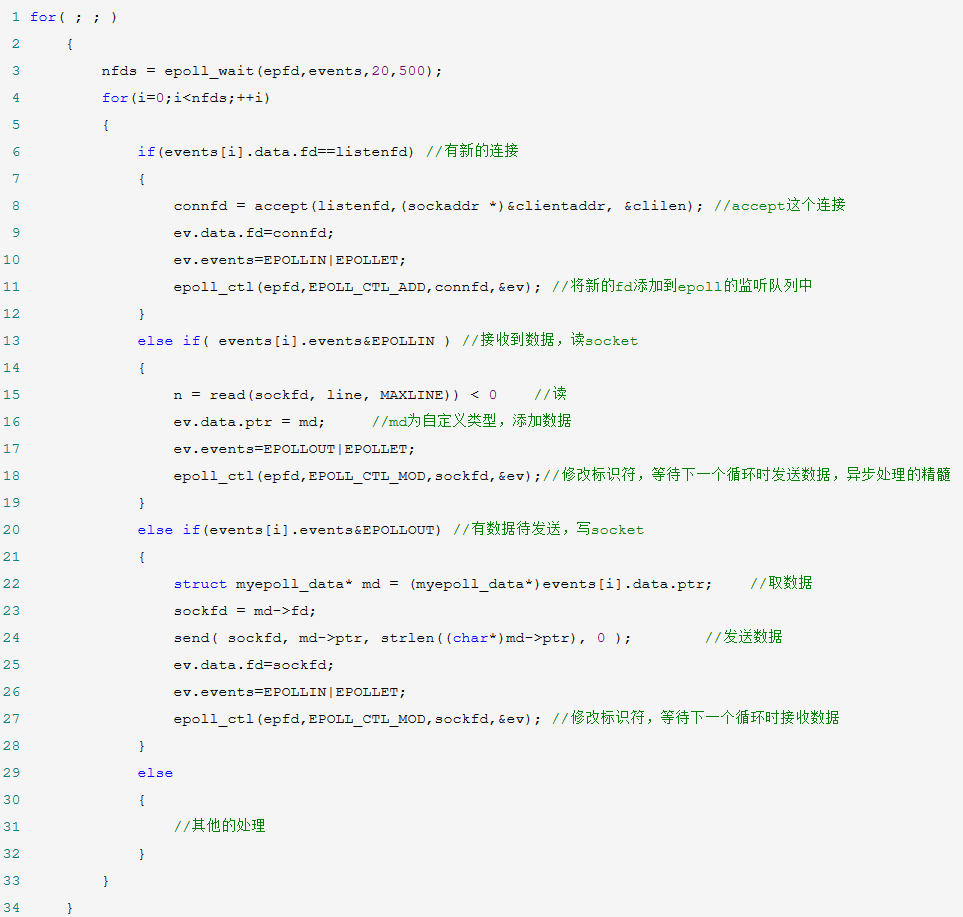